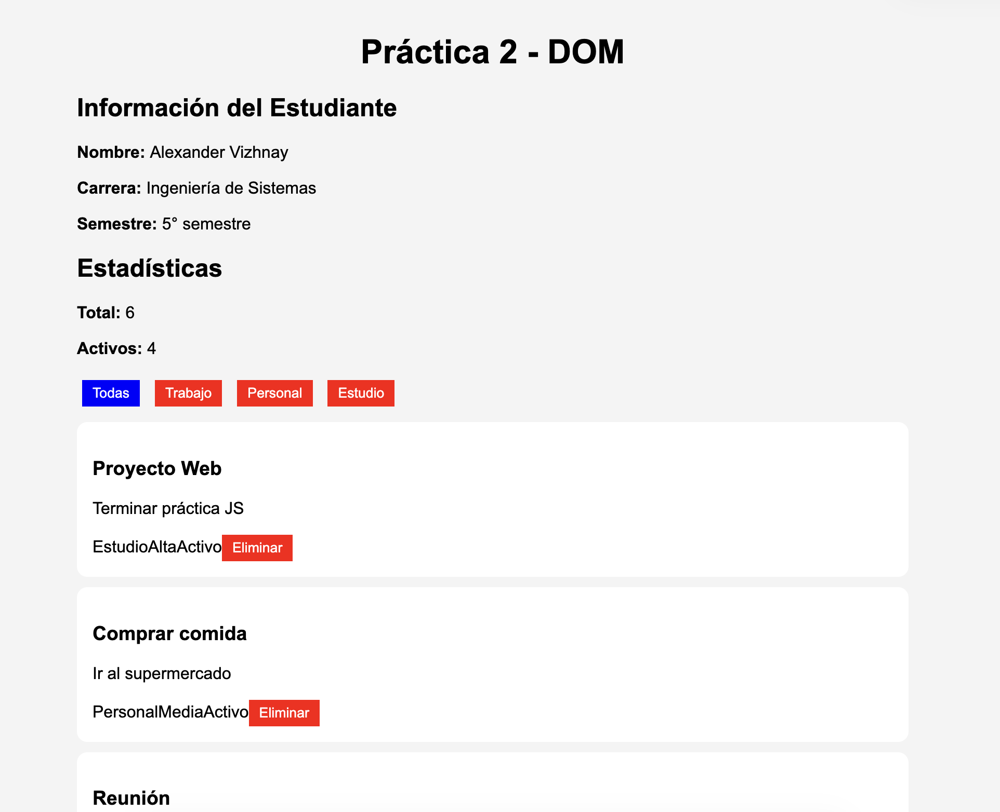
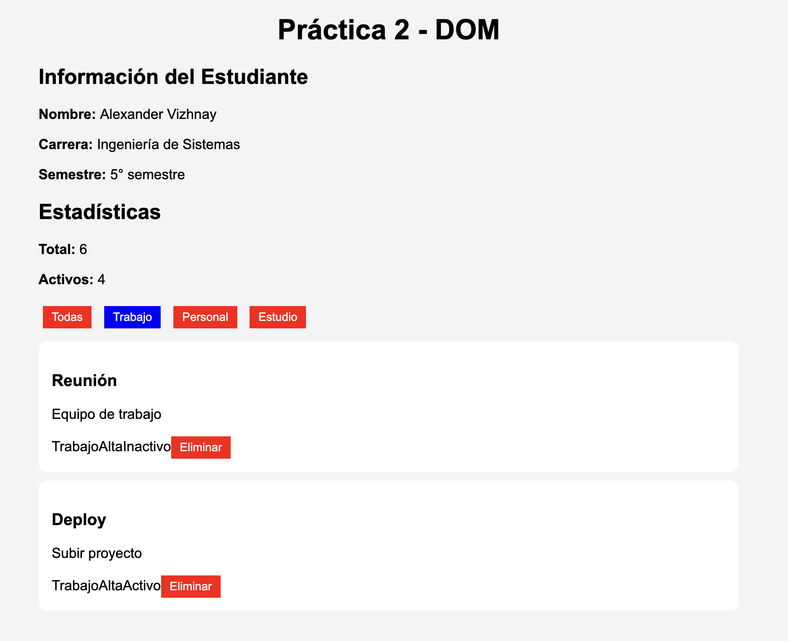
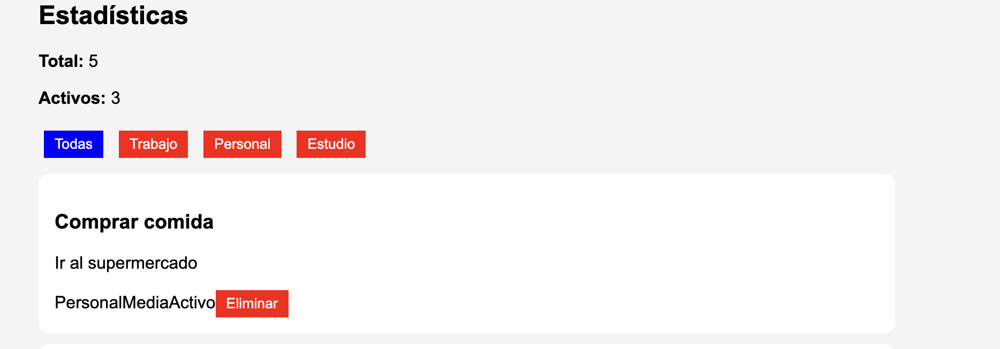

#  Práctica 2 - DOM Básico

## Descripción

Esta aplicación web fue desarrollada utilizando HTML, CSS y JavaScript, aplicando el manejo del DOM (Document Object Model).

El sistema permite:

- Mostrar información de un estudiante
- Renderizar dinámicamente una lista de elementos
- Filtrar elementos por categoría
- Eliminar elementos de la lista
- Mostrar estadísticas en tiempo real

El objetivo principal es comprender cómo manipular el DOM utilizando JavaScript puro (sin frameworks).

---

## Tecnologías utilizadas

- HTML5
- CSS3
- JavaScript (DOM)

---

## Estructura del proyecto

```
/02-dom-basico
  ├── index.html
  ├── css/
  │     └── styles.css
  ├── js/
  │     └── app.js
  ├── assets/
  │     ├── 01-vista-general.png
  │     ├── 02-filtrado.png
  │     └── ...
  └── README.md
```

---

## Funcionalidades principales

### Mostrar información del estudiante

Se utiliza `getElementById` para insertar los datos en el HTML.

```js
function mostrarInfoEstudiante() {
  document.getElementById('estudiante-nombre').textContent = estudiante.nombre;
  document.getElementById('estudiante-carrera').textContent = estudiante.carrera;
  document.getElementById('estudiante-semestre').textContent = `${estudiante.semestre}° semestre`;
}
```

---

### Renderizado dinámico de la lista

Se crean elementos HTML dinámicamente con `createElement`.

```js
function renderizarLista(datos) {
  const contenedor = document.getElementById('contenedor-lista');
  contenedor.innerHTML = '';

  datos.forEach(el => {
    const card = document.createElement('div');
    const titulo = document.createElement('h3');

    titulo.textContent = el.titulo;

    card.appendChild(titulo);
    contenedor.appendChild(card);
  });
}
```

---

### Eliminación de elementos

Se elimina un elemento del array y se vuelve a renderizar la lista.

```js
function eliminarElemento(id) {
  const index = elementos.findIndex(el => el.id === id);
  if (index !== -1) {
    elementos.splice(index, 1);
    renderizarLista(elementos);
  }
}
```

---

### Filtrado de elementos

Se filtran los datos según la categoría seleccionada.

```js
function inicializarFiltros() {
  const botones = document.querySelectorAll('.btn-filtro');

  botones.forEach(btn => {
    btn.addEventListener('click', () => {
      const categoria = btn.dataset.categoria;

      if (categoria === 'todas') {
        renderizarLista(elementos);
      } else {
        const filtrados = elementos.filter(e => e.categoria === categoria);
        renderizarLista(filtrados);
      }
    });
  });
}
```

---

### Estadísticas

Se muestran datos en tiempo real sobre la lista.

```js
function actualizarEstadisticas() {
  document.getElementById('total-elementos').textContent = elementos.length;
  document.getElementById('elementos-activos').textContent =
    elementos.filter(el => el.activo).length;
}
```

---

## Inicialización

Al cargar la página se ejecutan las funciones principales:

```js
mostrarInfoEstudiante();
renderizarLista(elementos);
inicializarFiltros();
```

---

## Evidencias

### Vista general


### Filtrado
 

### Eliminación


---

## Conclusión

Esta práctica permitió comprender:

- Cómo manipular el DOM
- Uso de eventos en JavaScript
- Renderizado dinámico de contenido
- Manejo de arrays y funciones

Es una base fundamental para el uso de frameworks como React o Angular.