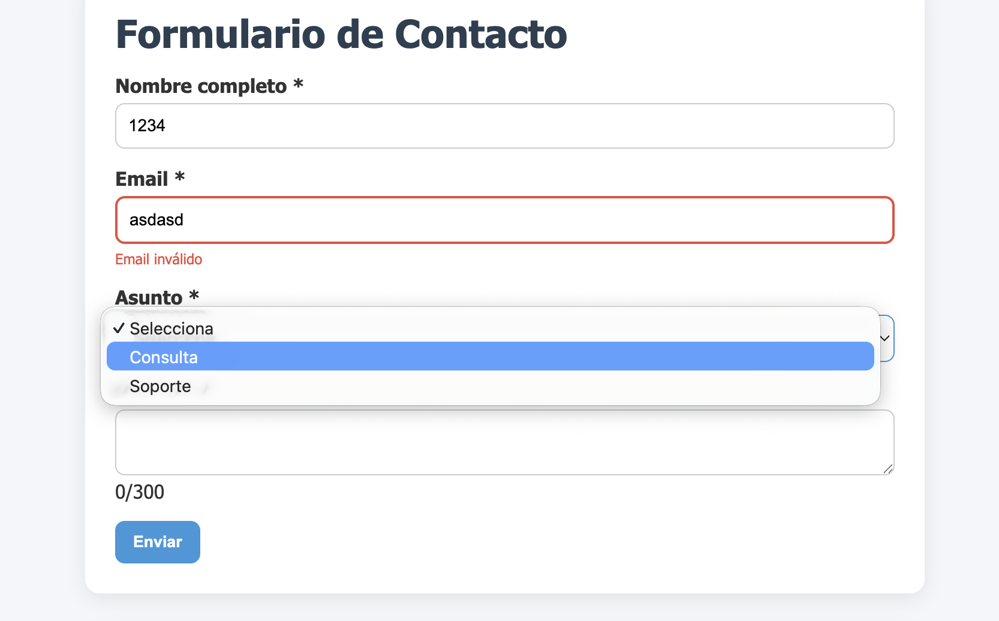
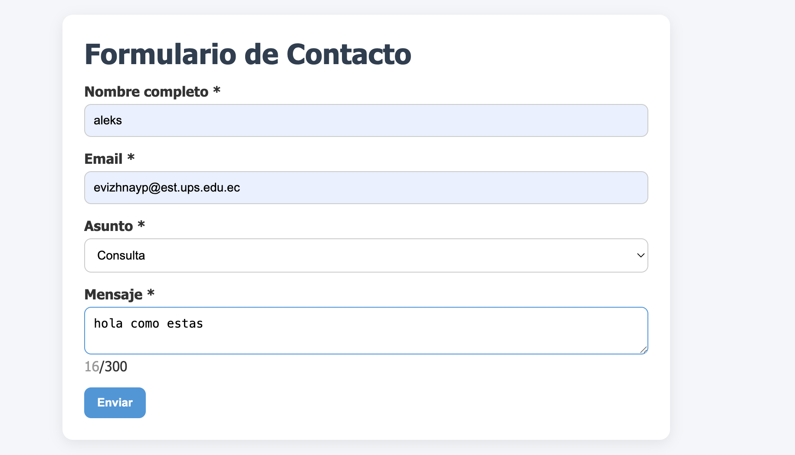
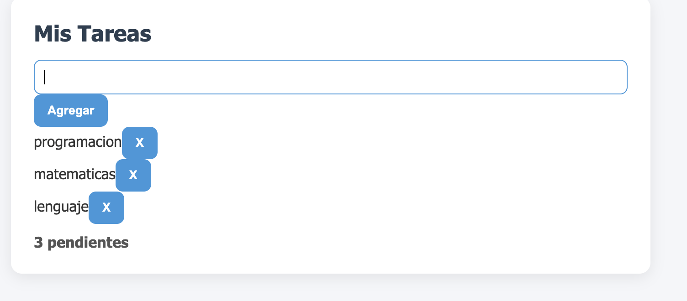
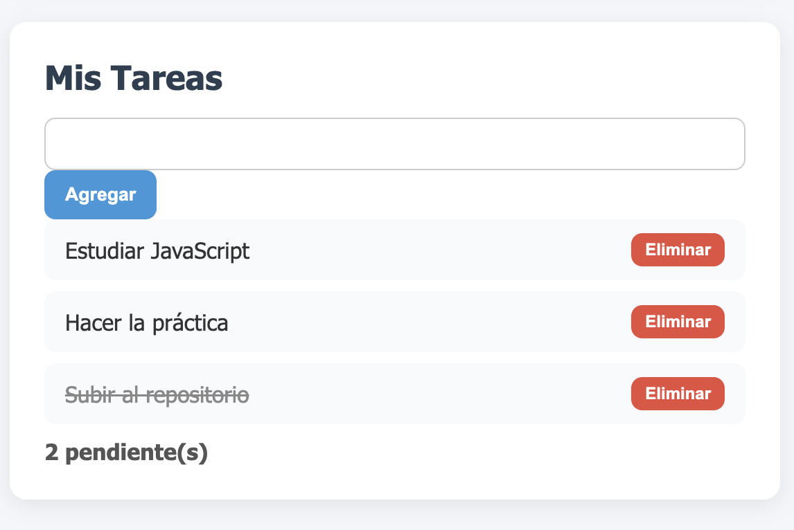

# 📌 Práctica 3 - Eventos en JavaScript

## 📖 Descripción

Esta práctica consiste en el desarrollo de una aplicación web que implementa el manejo de eventos en JavaScript puro.

Se construyen dos funcionalidades principales:

- Un formulario de contacto con validación en tiempo real
- Un sistema de gestión de tareas usando event delegation

El objetivo es aplicar conceptos como:

- Manejo de eventos (blur, input, submit, keydown)
- Validación de formularios
- Manipulación del DOM
- Event delegation

---

## 🛠️ Tecnologías utilizadas

- HTML5
- CSS3
- JavaScript (DOM y Eventos)

---

## 📂 Estructura del proyecto

```
/03-eventos
  ├── index.html
  ├── css/
  │     └── styles.css
  ├── js/
  │     └── app.js
  ├── assets/
  │     ├── 01-validacion.png
  │     ├── 02-formulario-enviado.png
  │     ├── 03-delegacion.png
  │     └── 04-contador.png
  └── README.md
```

---

## ⚙️ Funcionalidades principales

### 🔹 Validación de formulario

Se validan los campos:

- Nombre (mínimo 3 caracteres)
- Email (formato válido con regex)
- Asunto (no vacío)
- Mensaje (mínimo 10 caracteres)

Ejemplo:

```js
function validarNombre() {
  return inputNombre.value.trim().length >= 3;
}
```

---

### 🔹 Manejo del evento submit

Se utiliza `preventDefault()` para evitar la recarga y validar manualmente.

```js
formulario.addEventListener('submit', (e) => {
  e.preventDefault();
});
```

---

### 🔹 Contador de caracteres

Se actualiza en tiempo real con evento `input`.

```js
textMensaje.addEventListener('input', (e) => {
  const longitud = e.target.value.length;
});
```

---

### 🔹 Atajo de teclado

Se implementa Ctrl + Enter para enviar el formulario.

```js
document.addEventListener('keydown', (e) => {
  if (e.ctrlKey && e.key === 'Enter') {
    formulario.requestSubmit();
  }
});
```

---

### 🔹 Sistema de tareas

Permite:

- Agregar tareas
- Marcar como completadas
- Eliminar tareas

---

### 🔹 Event Delegation

Se usa un solo listener para manejar todos los eventos de la lista.

```js
listaTareas.addEventListener('click', (e) => {
  const action = e.target.dataset.action;
});
```

---

## 📸 Evidencias

### 🔹 Validación en acción


### 🔹 Formulario enviado


### 🔹 Event delegation funcionando


### 🔹 Contador de tareas


---

## 🎯 Conclusión

Esta práctica permitió:

- Comprender el manejo de eventos en JavaScript
- Validar formularios dinámicamente
- Manipular el DOM de forma segura
- Implementar event delegation
- Mejorar la experiencia de usuario con atajos y feedback visual

Es una base fundamental para el desarrollo de aplicaciones web modernas.