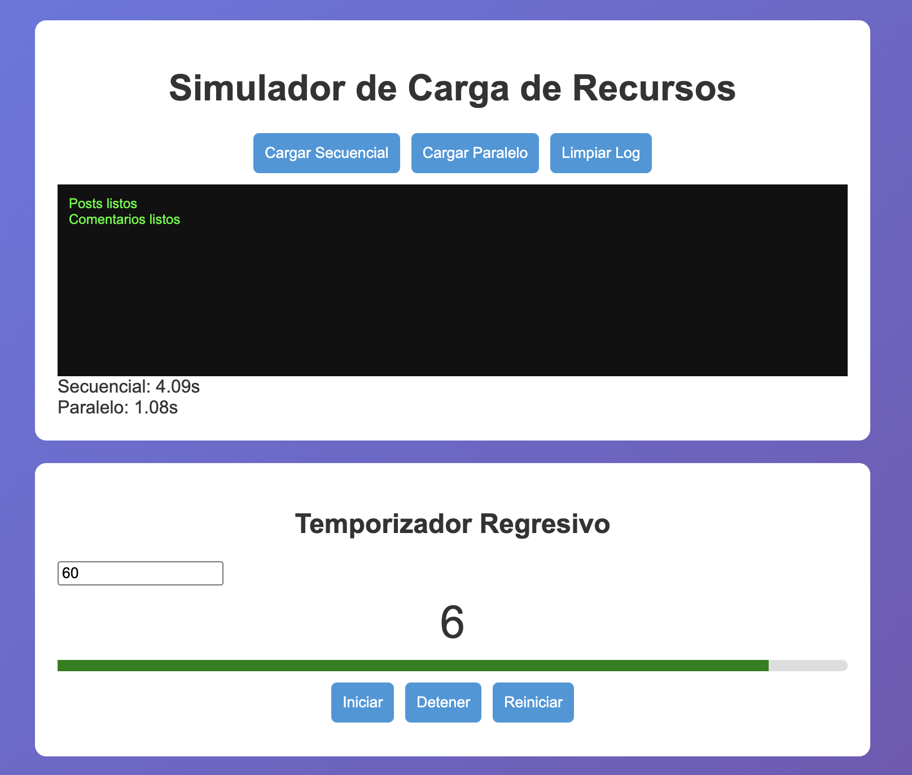
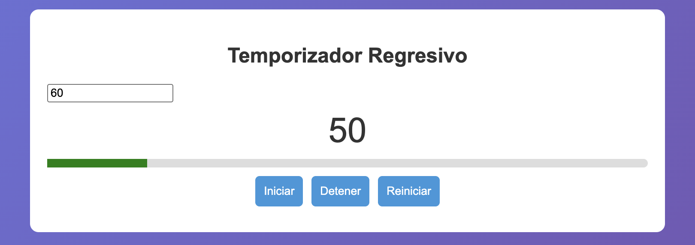
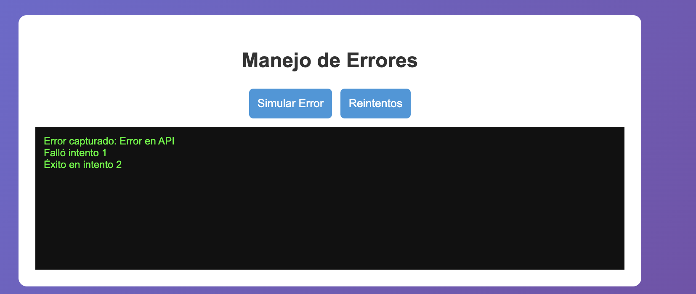

# 📌 Práctica 05 - Asincronía en JavaScript

## 🧠 Descripción

En esta práctica se implementó una aplicación web que demuestra conceptos fundamentales de asincronía en JavaScript.

Se desarrollaron tres módulos principales:

- Simulación de carga de recursos (secuencial vs paralela)
- Temporizador regresivo con barra de progreso
- Manejo de errores con try/catch y reintentos automáticos

El objetivo fue comprender el uso de Promesas, async/await, ejecución concurrente y manejo de errores.

---

## 📁 Estructura del Proyecto

```
/05-asincronia
│── index.html
│── css/
│   └── styles.css
│── js/
│   └── app.js
│── assets/
│   ├── 01-comparativa.png
│   ├── 02-temporizador.png
│   ├── 03-error.png
│── README.md
```

---

## ⚙️ Funcionalidades

### 🔹 1. Carga Secuencial vs Paralela

Se simulan peticiones usando promesas.

- Secuencial: ejecuta una por una (await)
- Paralela: ejecuta todas al mismo tiempo (Promise.all)

### Código:

```javascript
async function cargarSecuencial(){
  const u = await simularPeticion("Usuario");
  const p = await simularPeticion("Posts");
  const c = await simularPeticion("Comentarios");
}

async function cargarParalelo(){
  await Promise.all([
    simularPeticion("Usuario"),
    simularPeticion("Posts"),
    simularPeticion("Comentarios")
  ]);
}
```

---

### 🔹 2. Temporizador

Se implementó un contador regresivo con:

- setInterval
- Barra de progreso
- Botones de control

### Código:

```javascript
intervalo = setInterval(()=>{
  restante--;
  actualizar();
  if(restante<=0){
    clearInterval(intervalo);
  }
},1000);
```

---

### 🔹 3. Manejo de Errores

Uso de try/catch y reintentos.

### Código:

```javascript
try{
  await simularPeticion("API",500,1000,true);
}catch(e){
  console.log("Error:", e.message);
}
```

---

## 🧪 Evidencias

### 📊 1. Comparativa Secuencial vs Paralelo


Descripción:  
La carga paralela es más rápida porque ejecuta todas las peticiones al mismo tiempo.

---

### ⏱️ 2. Temporizador


Descripción:  
El temporizador muestra el tiempo restante y la barra de progreso.

---

### ❌ 3. Manejo de errores


Descripción:  
El error es capturado correctamente sin romper la aplicación.

---

## 📊 Análisis

- Promise.all mejora el rendimiento
- async/await hace el código más claro
- Manejar errores evita fallos del sistema
- La ejecución paralela es más eficiente

---

## ✅ Conclusiones

- La asincronía es esencial en desarrollo web
- Permite mejorar rendimiento
- Mejora la experiencia del usuario
- Hace el sistema más robusto

---

## 👨‍💻 Autor

Alexander vizhnay  
Ingeniería de Sistemas  